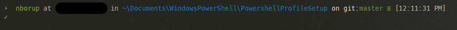

# PowershellProfileSetup
This repository is for setting up the powershell console prompt, and for configuring my cmder settings as well as adding some basic profile methods such as pulling up all solution files in my projects folder and being able to search them using a combination of [ripgrep](https://github.com/BurntSushi/ripgrep)
 and [fzf](https://github.com/kelleyma49/PSFzf).

Here is an example of what the console looks like:

## Getting Started
Clone this repository and run the setup.ps1 file.

Copy the Microsoft.Powershell_profile.ps1 into $env:Userprofile\Documents\WindowsPowershell\

Open Cmder and import the newCmderSettings.xml file in the settings screen.

Restart Cmder to apply the settings and verify your profile is being run.