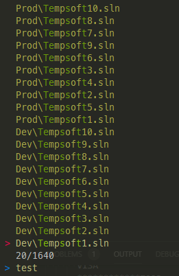

# PowershellProfileSetup
This repository is for setting up the powershell console prompt that uses the following repos/applications:
* [posh-git](https://github.com/dahlbyk/posh-git)
* [oh-my-posh](https://github.com/JanDeDobbeleer/oh-my-posh)
* [zlocation](https://github.com/vors/ZLocation)
* [fzf](https://github.com/kelleyma49/PSFzf)
* [ripgrep](https://github.com/BurntSushi/ripgrep)
* [chocolatey](https://chocolatey.org/)

It also configures my [cmder](https://cmder.net/) settings as well as adding some basic profile methods such as pulling up all solution files in my projects folder and being able to search them using a combination of [ripgrep](https://github.com/BurntSushi/ripgrep)
 and [fzf](https://github.com/kelleyma49/PSFzf).

Here is an example of what the console looks like:

Here is an example of what the Open-Solution function looks like using a combination of ripgrep to find all *.sln files and then using the fuzzy finder to filter them:

## Getting Started
Clone this repository and run the setup.ps1 file.

Copy the Microsoft.Powershell_profile.ps1 into $env:Userprofile\Documents\WindowsPowershell\

Open Cmder and import the newCmderSettings.xml file in the settings screen.

Restart Cmder to apply the settings and verify your profile is being run.